# 🏗️ Clean Custard Analytics Platform - Complete Architecture Diagram

*Generated: 2025-01-27*

## 📋 System Overview

Clean Custard is a secure, AI-powered platform that allows users to ask natural language questions about their databases and get instant, accurate answers. The platform uses a microservices architecture with real-time WebSocket communication between components.

## 🎯 Core Architecture Components

### 1. **Frontend Layer** (React/TypeScript)
- **Deployment**: Vercel
- **Technology**: React 18, TypeScript, Vite, shadcn/ui, Tailwind CSS
- **Communication**: HTTP REST API + WebSocket for real-time updates

### 2. **Backend Layer** (FastAPI)
- **Deployment**: Railway/Render
- **Technology**: FastAPI, SQLAlchemy, Alembic, WebSockets, LangChain
- **Communication**: REST API + WebSocket Server

### 3. **Agent Layer** (Docker Containers)
- **PostgreSQL Agent**: Python + psycopg2 + WebSocket Client
- **MongoDB Agent**: Python + pymongo + WebSocket Client
- **Communication**: WebSocket Client → Backend WebSocket Server

### 4. **Database Layer**
- **Application Database**: PostgreSQL (Supabase) - User data, connections, metadata
- **Customer Databases**: Various (PostgreSQL, MongoDB, etc.) - User's actual data
- **Cache**: Redis - Session management, rate limiting, caching

### 5. **External Services**
- **OpenAI API**: Natural language processing and SQL generation
- **Resend**: Email service for user verification
- **Cloudinary**: File upload and storage service
- **LangSmith**: LLM monitoring and debugging (optional)

---

## 🔄 Complete Service Communication Diagram

```mermaid
graph TB
    %% External Users and Systems
    User[👤 User Browser]
    CustomerDB1[(🗄️ Customer PostgreSQL)]
    CustomerDB2[(🗄️ Customer MongoDB)]
    CustomerDB3[(🗄️ Customer Other DBs)]
    
    %% Frontend Layer
    subgraph "🌐 Frontend Layer (Vercel)"
        React[⚛️ React App]
        Pages[📄 Pages]
        Components[🧩 Components]
        Services[🔧 API Services]
        Hooks[🎣 Custom Hooks]
    end
    
    %% Backend Layer
    subgraph "⚙️ Backend Layer (Railway/Render)"
        FastAPI[🚀 FastAPI Server]
        
        subgraph "📡 API Endpoints"
            AuthAPI[🔐 Auth API]
            ConnAPI[🔗 Connection API]
            QueryAPI[❓ Query API]
            StatusAPI[📊 Status API]
            WebSocketAPI[🔌 WebSocket API]
        end
        
        subgraph "🧠 Core Services"
            JWT[🔑 JWT Handler]
            Email[📧 Email Service]
            Redis[⚡ Redis Service]
            RateLimit[🚦 Rate Limiter]
            APIKey[🗝️ API Key Service]
        end
        
        subgraph "🤖 AI Services"
            LLM[🧠 LLM Service]
            DataAnalysis[📊 Data Analysis Service]
            CSVConverter[📄 CSV to SQL Converter]
        end
        
        subgraph "🗄️ Database Layer"
            AppDB[(📊 Application DB)]
            DBSession[🔗 DB Session Manager]
            Models[📋 SQLAlchemy Models]
        end
        
        subgraph "🌐 WebSocket Management"
            WSManager[🔌 Connection Manager]
            WSCors[🌍 WebSocket CORS]
        end
    end
    
    %% Agent Layer
    subgraph "🤖 Agent Layer (Docker Containers)"
        subgraph "PostgreSQL Agent"
            PGAgent[🐘 PostgreSQL Agent]
            PGSchema[🔍 Schema Discoverer]
            PGQuery[📝 Query Executor]
        end
        
        subgraph "MongoDB Agent"
            MongoAgent[🍃 MongoDB Agent]
            MongoSchema[🔍 Mongo Schema Discoverer]
            MongoQuery[📝 Mongo Query Executor]
        end
    end
    
    %% External Services
    subgraph "🌍 External Services"
        OpenAI[🤖 OpenAI API]
        Resend[📧 Resend Email]
        Cloudinary[☁️ Cloudinary]
        LangSmith[📈 LangSmith]
    end
    
    %% User Interactions
    User -->|HTTPS| React
    User -->|WebSocket| React
    
    %% Frontend Internal Communication
    React --> Pages
    Pages --> Components
    Components --> Services
    Components --> Hooks
    Services -->|HTTP| FastAPI
    Hooks -->|WebSocket| FastAPI
    
    %% Backend API Routing
    FastAPI --> AuthAPI
    FastAPI --> ConnAPI
    FastAPI --> QueryAPI
    FastAPI --> StatusAPI
    FastAPI --> WebSocketAPI
    
    %% Authentication Flow
    AuthAPI --> JWT
    AuthAPI --> Email
    Email -->|SMTP| Resend
    
    %% Connection Management
    ConnAPI --> APIKey
    ConnAPI --> DBSession
    DBSession --> Models
    Models --> AppDB
    
    %% Query Processing
    QueryAPI --> LLM
    QueryAPI --> DataAnalysis
    QueryAPI --> CSVConverter
    LLM -->|API Call| OpenAI
    DataAnalysis --> CSVConverter
    
    %% WebSocket Communication
    WebSocketAPI --> WSManager
    WSManager --> WSCors
    WSManager -->|WebSocket| PGAgent
    WSManager -->|WebSocket| MongoAgent
    
    %% Agent to Database Communication
    PGAgent --> PGSchema
    PGAgent --> PGQuery
    PGSchema -->|psycopg2| CustomerDB1
    PGQuery -->|psycopg2| CustomerDB1
    
    MongoAgent --> MongoSchema
    MongoAgent --> MongoQuery
    MongoSchema -->|pymongo| CustomerDB2
    MongoQuery -->|pymongo| CustomerDB2
    
    %% Backend to Application Database
    FastAPI --> DBSession
    DBSession --> AppDB
    
    %% Caching and Rate Limiting
    FastAPI --> Redis
    RateLimit --> Redis
    
    %% Optional Monitoring
    LLM -.->|Optional| LangSmith
    
    %% Styling
    classDef frontend fill:#e1f5fe
    classDef backend fill:#f3e5f5
    classDef agent fill:#e8f5e8
    classDef database fill:#fff3e0
    classDef external fill:#fce4ec
    
    class React,Pages,Components,Services,Hooks frontend
    class FastAPI,AuthAPI,ConnAPI,QueryAPI,StatusAPI,WebSocketAPI,JWT,Email,Redis,RateLimit,APIKey,LLM,DataAnalysis,CSVConverter,AppDB,DBSession,Models,WSManager,WSCors backend
    class PGAgent,PGSchema,PGQuery,MongoAgent,MongoSchema,MongoQuery agent
    class CustomerDB1,CustomerDB2,CustomerDB3,AppDB database
    class OpenAI,Resend,Cloudinary,LangSmith external
```



---

## 🎯 **End-to-End Architecture Visual**

### **Complete System Flow Diagram**

```
┌─────────────────────────────────────────────────────────────────────────────────────────────────┐
│                                    🌐 USER INTERFACE LAYER                                      │
├─────────────────────────────────────────────────────────────────────────────────────────────────┤
│                                                                                                 │
│  👤 USER BROWSER                                                                                │
│  ┌─────────────────────────────────────────────────────────────────────────────────────────┐   │
│  │  🌐 HTTPS/WebSocket                                                                     │   │
│  │  ┌─────────────────────────────────────────────────────────────────────────────────┐   │   │
│  │  │  ⚛️ REACT FRONTEND (Vercel)                                                    │   │   │
│  │  │  ┌─────────────────────────────────────────────────────────────────────────┐   │   │   │
│  │  │  │  📄 Pages: Dashboard, Connections, TalkData, Settings                   │   │   │   │
│  │  │  │  🧩 Components: Forms, Tables, Charts, Modals                          │   │   │   │
│  │  │  │  🔧 Services: API calls, Authentication, File Upload                  │   │   │   │
│  │  │  │  🎣 Hooks: WebSocket, Data Fetching, State Management                  │   │   │   │
│  │  │  └─────────────────────────────────────────────────────────────────────────┘   │   │   │
│  │  └─────────────────────────────────────────────────────────────────────────────────┘   │   │
│  └─────────────────────────────────────────────────────────────────────────────────────────┘   │
└─────────────────────────────────────────────────────────────────────────────────────────────────┘
                                        │
                                        │ HTTPS REST API + WebSocket
                                        ▼
┌─────────────────────────────────────────────────────────────────────────────────────────────────┐
│                                    ⚙️ BACKEND LAYER (Railway)                                   │
├─────────────────────────────────────────────────────────────────────────────────────────────────┤
│                                                                                                 │
│  🚀 FASTAPI SERVER                                                                              │
│  ┌─────────────────────────────────────────────────────────────────────────────────────────┐   │
│  │  📡 API ENDPOINTS                    🧠 CORE SERVICES              🤖 AI SERVICES     │   │
│  │  ┌─────────────────────────┐       ┌─────────────────────────┐   ┌─────────────────┐   │   │
│  │  │  🔐 Auth API             │       │  🔑 JWT Handler         │   │  🧠 LLM Service │   │   │
│  │  │  🔗 Connection API       │       │  📧 Email Service       │   │  📊 Data Analysis│   │   │
│  │  │  ❓ Query API            │       │  ⚡ Redis Service       │   │  📄 CSV Converter│   │   │
│  │  │  📊 Status API           │       │  🚦 Rate Limiter        │   │                 │   │   │
│  │  │  🔌 WebSocket API        │       │  🗝️ API Key Service    │   │                 │   │   │
│  │  └─────────────────────────┘       └─────────────────────────┘   └─────────────────┘   │   │
│  │                                                                                             │   │
│  │  🗄️ DATABASE LAYER                    🌐 WEBSOCKET MANAGEMENT                              │   │
│  │  ┌─────────────────────────┐       ┌─────────────────────────┐                           │   │
│  │  │  📊 Application DB      │       │  🔌 Connection Manager  │                           │   │
│  │  │  🔗 DB Session Manager  │       │  🌍 WebSocket CORS      │                           │   │
│  │  │  📋 SQLAlchemy Models   │       │                         │                           │   │
│  │  └─────────────────────────┘       └─────────────────────────┘                           │   │
│  └─────────────────────────────────────────────────────────────────────────────────────────┘   │
└─────────────────────────────────────────────────────────────────────────────────────────────────┘
                                        │
                                        │ WebSocket Communication
                                        ▼
┌─────────────────────────────────────────────────────────────────────────────────────────────────┐
│                                    🤖 AGENT LAYER (Docker)                                      │
├─────────────────────────────────────────────────────────────────────────────────────────────────┤
│                                                                                                 │
│  🐘 POSTGRESQL AGENT                    🍃 MONGODB AGENT                                        │
│  ┌─────────────────────────┐            ┌─────────────────────────┐                             │
│  │  🔍 Schema Discoverer   │            │  🔍 Schema Discoverer  │                             │
│  │  📝 Query Executor      │            │  📝 Query Executor     │                             │
│  │  🔒 Security Sandbox    │            │  🔒 Security Sandbox   │                             │
│  └─────────────────────────┘            └─────────────────────────┘                             │
│           │                                        │                                            │
│           │ psycopg2                               │ pymongo                                    │
│           ▼                                        ▼                                            │
│  ┌─────────────────────────┐            ┌─────────────────────────┐                             │
│  │  🗄️ Customer PostgreSQL │            │  🗄️ Customer MongoDB    │                             │
│  └─────────────────────────┘            └─────────────────────────┘                             │
└─────────────────────────────────────────────────────────────────────────────────────────────────┘
                                        │
                                        │ External API Calls
                                        ▼
┌─────────────────────────────────────────────────────────────────────────────────────────────────┐
│                                    🌍 EXTERNAL SERVICES                                         │
├─────────────────────────────────────────────────────────────────────────────────────────────────┤
│                                                                                                 │
│  🤖 OpenAI API              📧 Resend Email           ☁️ Cloudinary           📈 LangSmith      │
│  ┌─────────────────┐       ┌─────────────────┐      ┌─────────────────┐   ┌─────────────────┐ │
│  │  Natural Language│       │  Email Delivery │      │  File Storage   │   │  LLM Monitoring │ │
│  │  Processing     │       │  Verification   │      │  Image Upload   │   │  Debugging      │ │
│  │  SQL Generation │       │  Password Reset │      │  CDN Delivery   │   │  Analytics      │ │
│  └─────────────────┘       └─────────────────┘      └─────────────────┘   └─────────────────┘ │
└─────────────────────────────────────────────────────────────────────────────────────────────────┘
```

---

## 🔄 **End-to-End Data Flow Examples**

### **1. User Query Flow (Natural Language → Database Results)**

```
👤 USER INPUT: "Show me sales data for last month"
    │
    ▼ HTTPS POST /api/v1/query
🌐 FRONTEND (React)
    │
    ▼ HTTP Request with JWT
⚙️ BACKEND (FastAPI)
    │
    ▼ Route to Query API
❓ QUERY API
    │
    ▼ Process with LLM Service
🧠 LLM SERVICE
    │
    ▼ API Call to OpenAI
🤖 OPENAI API
    │
    ▼ Generated SQL Query
🧠 LLM SERVICE
    │
    ▼ Send to WebSocket Manager
🔌 WEBSOCKET MANAGER
    │
    ▼ WebSocket Message
🤖 POSTGRESQL AGENT
    │
    ▼ Execute SQL Query
🗄️ CUSTOMER DATABASE
    │
    ▼ Query Results
🤖 POSTGRESQL AGENT
    │
    ▼ WebSocket Response
🔌 WEBSOCKET MANAGER
    │
    ▼ HTTP Response
⚙️ BACKEND (FastAPI)
    │
    ▼ JSON Response
🌐 FRONTEND (React)
    │
    ▼ Display Results
👤 USER SEES: Sales data table/chart
```

### **2. File Upload & Analysis Flow**

```
👤 USER UPLOADS: CSV file
    │
    ▼ HTTPS POST /api/v1/upload
🌐 FRONTEND (React)
    │
    ▼ HTTP Request with file
⚙️ BACKEND (FastAPI)
    │
    ▼ Upload to Cloudinary
☁️ CLOUDINARY
    │
    ▼ File URL returned
⚙️ BACKEND (FastAPI)
    │
    ▼ Convert CSV to SQLite
📄 CSV CONVERTER
    │
    ▼ Store in memory
⚙️ BACKEND (FastAPI)
    │
    ▼ User asks question about CSV
👤 USER INPUT: "What's the average revenue?"
    │
    ▼ HTTPS POST /api/v1/query
🌐 FRONTEND (React)
    │
    ▼ HTTP Request
⚙️ BACKEND (FastAPI)
    │
    ▼ Route to Data Analysis Service
📊 DATA ANALYSIS SERVICE
    │
    ▼ Generate pandas query
📊 DATA ANALYSIS SERVICE
    │
    ▼ Execute on SQLite data
📄 CSV CONVERTER
    │
    ▼ Return results
⚙️ BACKEND (FastAPI)
    │
    ▼ JSON Response
🌐 FRONTEND (React)
    │
    ▼ Display Results
👤 USER SEES: Average revenue calculation
```

### **3. Real-time Connection Status Flow**

```
👤 USER VIEWS: Connection status
    │
    ▼ WebSocket Connection
🌐 FRONTEND (React)
    │
    ▼ WebSocket Message
⚙️ BACKEND (FastAPI)
    │
    ▼ Check Agent Status
🔌 WEBSOCKET MANAGER
    │
    ▼ Ping Agent
🤖 POSTGRESQL AGENT
    │
    ▼ Pong Response
🔌 WEBSOCKET MANAGER
    │
    ▼ Status Update
⚙️ BACKEND (FastAPI)
    │
    ▼ WebSocket Broadcast
🌐 FRONTEND (React)
    │
    ▼ Update UI
👤 USER SEES: "Agent Connected" status
```

---

## 🎯 **Key Architecture Patterns**

### **1. Microservices Communication**
- **Synchronous**: HTTP REST API calls
- **Asynchronous**: WebSocket real-time communication
- **Event-driven**: Status updates and notifications

### **2. Security Layers**
- **Authentication**: JWT tokens with email verification
- **Authorization**: API keys for agent access
- **Data Protection**: Read-only database access
- **Network Security**: HTTPS/TLS encryption

### **3. Scalability Design**
- **Horizontal Scaling**: Independent service scaling
- **Load Distribution**: CDN and caching layers
- **Resource Management**: Docker containerization
- **Database Optimization**: Connection pooling and caching

### **4. Monitoring & Observability**
- **Health Checks**: Multiple endpoint monitoring
- **Real-time Status**: WebSocket-based monitoring
- **Logging**: Structured logging across all services
- **External Monitoring**: LangSmith integration

---

## 🔗 Detailed Communication Patterns

### 1. **User Authentication Flow**
```
User → React → AuthAPI → JWT Handler → Email Service → Resend → User Email
```

### 2. **Database Connection Flow**
```
User → React → ConnAPI → API Key Service → AppDB → WebSocket Manager → Agent → Customer DB
```

### 3. **Query Processing Flow**
```
User → React → QueryAPI → LLM Service → OpenAI API → Agent → Customer DB → Results → User
```

### 4. **Real-time Communication Flow**
```
User ↔ React ↔ WebSocket ↔ Backend ↔ Agent ↔ Customer Database
```

---

## 📊 Service Details

### **Frontend Services**
| Service | Technology | Purpose | Communication |
|---------|------------|---------|----------------|
| React App | React 18 + TypeScript | User Interface | HTTP + WebSocket |
| API Services | Axios + React Query | API Communication | HTTP REST |
| WebSocket Hook | Custom React Hook | Real-time Updates | WebSocket |
| Components | shadcn/ui | UI Components | Internal |

### **Backend Services**
| Service | Technology | Purpose | Communication |
|---------|------------|---------|----------------|
| FastAPI Server | FastAPI + Python | Main API Server | HTTP + WebSocket |
| Auth API | JWT + Email | User Authentication | HTTP + SMTP |
| Connection API | SQLAlchemy | DB Connection Mgmt | HTTP + SQL |
| Query API | LangChain + OpenAI | Query Processing | HTTP + OpenAI API |
| WebSocket Manager | WebSocket | Real-time Comm | WebSocket |
| Data Analysis | Pandas + SQLite | CSV Analysis | Internal |
| CSV Converter | SQLite + Pandas | CSV to SQL | Internal |

### **Agent Services**
| Service | Technology | Purpose | Communication |
|---------|------------|---------|----------------|
| PostgreSQL Agent | Python + psycopg2 | PostgreSQL Queries | WebSocket + SQL |
| MongoDB Agent | Python + pymongo | MongoDB Queries | WebSocket + NoSQL |
| Schema Discoverer | Custom Python | Schema Analysis | Database Direct |

### **External Services**
| Service | Purpose | Communication | Status |
|---------|---------|---------------|--------|
| OpenAI API | Natural Language Processing | HTTPS API | ✅ Active |
| Resend | Email Delivery | SMTP | ✅ Active |
| Cloudinary | File Storage | HTTPS API | ✅ Active |
| LangSmith | LLM Monitoring | HTTPS API | ⚪ Optional |

---

## 🔒 Security Architecture

### **Authentication & Authorization**
- **JWT Tokens**: Secure token-based authentication
- **Email Verification**: Required for account activation
- **API Keys**: Unique keys for agent authentication
- **Rate Limiting**: Redis-based request throttling

### **Data Security**
- **Read-Only Access**: Agents can only execute SELECT queries
- **Sandboxed Execution**: Agents run in isolated Docker containers
- **Encrypted Communication**: All data transmission uses TLS/HTTPS
- **Query Validation**: SQL queries validated before execution

### **Network Security**
- **CORS Configuration**: Proper cross-origin resource sharing
- **WebSocket Security**: Secure WebSocket connections with CORS validation
- **Database Isolation**: Customer databases remain in their own networks

---

## 🚀 Deployment Architecture

### **Production Deployment**
```
┌─────────────────┐    ┌─────────────────┐    ┌─────────────────┐
│   Frontend      │    │   Backend       │    │   Agent         │
│   (Vercel)      │◄──►│   (Railway)     │◄──►│   (Docker)      │
│   React App     │    │   FastAPI       │    │   PostgreSQL   │
│   Static Files  │    │   WebSocket     │    │   MongoDB      │
└─────────────────┘    └─────────────────┘    └─────────────────┘
         │                       │                       │
         │                       │                       │
         ▼                       ▼                       ▼
┌─────────────────┐    ┌─────────────────┐    ┌─────────────────┐
│   CDN           │    │   Database      │    │   Customer DB  │
│   (Vercel CDN)  │    │   (Supabase)    │    │   (Various)    │
└─────────────────┘    └─────────────────┘    └─────────────────┘
```

### **Development Deployment**
```
┌─────────────────┐    ┌─────────────────┐    ┌─────────────────┐
│   Frontend      │    │   Backend       │    │   Agent         │
│   (localhost:3000)│◄──►│   (localhost:8000)│◄──►│   (Docker)      │
│   Vite Dev      │    │   FastAPI Dev   │    │   Local Agent   │
└─────────────────┘    └─────────────────┘    └─────────────────┘
```

---

## 📈 Monitoring & Health Checks

### **Health Check Endpoints**
- `/health` - Basic health check
- `/status` - Detailed system status
- `/ready` - Readiness probe
- `/production-readiness` - Production readiness check

### **Monitoring Services**
- **Application Logs**: Structured logging with different levels
- **WebSocket Status**: Real-time connection monitoring
- **Database Health**: Connection pool monitoring
- **External Services**: OpenAI, Resend, Redis health checks

---

## 🔄 Data Flow Examples

### **1. User Registration Flow**
```
1. User submits registration form
2. Frontend → Backend Auth API
3. Backend generates JWT + sends verification email
4. Email Service → Resend → User Email
5. User clicks verification link
6. Account activated → User can login
```

### **2. Database Query Flow**
```
1. User asks natural language question
2. Frontend → Query API
3. Query API → LLM Service → OpenAI API
4. LLM generates SQL query
5. Query API → WebSocket Manager → Agent
6. Agent executes query on customer database
7. Results flow back: Agent → Backend → Frontend → User
```

### **3. File Upload & Analysis Flow**
```
1. User uploads CSV file
2. Frontend → File Upload API
3. Backend → Cloudinary (file storage)
4. Backend → CSV Converter (SQLite conversion)
5. User asks questions about CSV data
6. Data Analysis Service processes queries
7. Results returned to user
```

---

## 🎯 Key Architectural Decisions

### **Microservices Architecture**
- **Separation of Concerns**: Each service has a specific responsibility
- **Scalability**: Services can be scaled independently
- **Technology Diversity**: Different technologies for different needs

### **WebSocket Communication**
- **Real-time Updates**: Instant communication between backend and agents
- **Bidirectional**: Both sides can initiate communication
- **Persistent Connections**: Maintained connections for efficiency

### **Agent-Based Database Access**
- **Security**: Customer databases never directly exposed to backend
- **Flexibility**: Support for multiple database types
- **Isolation**: Each agent runs in its own container

### **AI-First Design**
- **Natural Language Interface**: Users don't need SQL knowledge
- **Intelligent Query Generation**: LLM converts questions to SQL
- **Context Awareness**: Schema understanding for better queries

---

## 🔧 Configuration & Environment

### **Environment Variables**
- **Frontend**: `VITE_API_BASE_URL`
- **Backend**: `DATABASE_URL`, `OPENAI_API_KEY`, `SECRET_KEY`
- **Agents**: `BACKEND_WEBSOCKET_URI`, `CONNECTION_ID`, `DB_*`
- **External**: `RESEND_API_KEY`, `CLOUDINARY_URL`

### **Configuration Files**
- **Docker Compose**: Agent orchestration
- **Alembic**: Database migrations
- **Vite Config**: Frontend build configuration
- **Tailwind Config**: UI styling configuration

---

This architecture diagram provides a comprehensive view of all services, their communication patterns, and the complete data flow throughout the Clean Custard Analytics Platform. Each component is designed to work together seamlessly while maintaining security, scalability, and performance.
