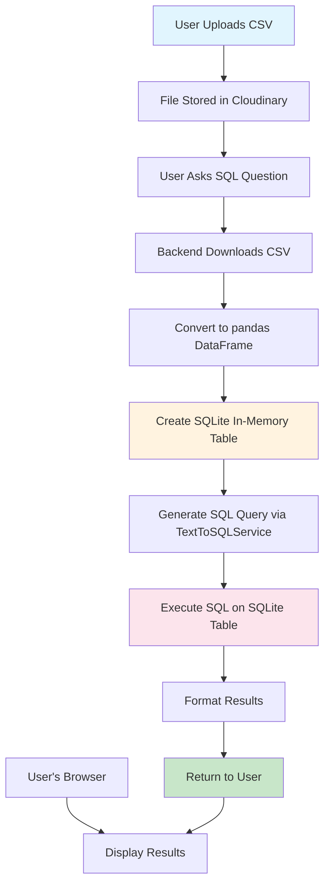

# CSV-to-SQL Implementation Strategy: DataFrame + SQLite Approach

## Executive Summary

Clean-custard is implementing a **DataFrame + SQLite approach** to enable SQL queries on uploaded CSV data, providing users with the power of SQL while maintaining simplicity and cost-effectiveness. This approach converts CSV data into in-memory SQLite tables, allowing users to leverage existing SQL knowledge and tools.

## Product Goals

### Primary Objectives
- **Enable SQL Queries on CSV Data**: Allow users to write SQL queries against uploaded CSV files
- **Maintain Simplicity**: Keep the implementation simple and maintainable
- **Cost Effectiveness**: Minimize development and operational costs
- **Fast Time-to-Market**: Deliver functionality quickly to meet user demands
- **User Experience**: Provide familiar SQL interface for data analysis

### Success Metrics
- **User Adoption**: 80% of CSV users utilize SQL query functionality
- **Query Performance**: < 2 seconds response time for queries on files < 100MB
- **Development Cost**: < $50,000 total implementation cost
- **Time to Market**: < 3 months from start to production
- **User Satisfaction**: > 4.5/5 rating for SQL query functionality

## Technical Approach

### Architecture Overview
```
CSV Upload → Cloudinary Storage → Backend Download → pandas DataFrame → SQLite In-Memory Table → SQL Query Execution → Results
```

### Implementation Strategy
1. **Data Conversion**: Convert CSV to pandas DataFrame
2. **SQLite Integration**: Create in-memory SQLite table from DataFrame
3. **Query Execution**: Execute SQL queries using SQLite engine
4. **Result Formatting**: Return formatted results to user

## Visual Flow Diagram

### Architecture Overview
```
┌─────────────────┐    ┌─────────────────┐    ┌─────────────────┐
│   User's Browser │    │  Clean-Custard  │    │   Cloudinary    │
│                 │    │     Backend      │    │   (File Storage)│
├─────────────────┤    ├─────────────────┤    ├─────────────────┤
│ • Upload CSV    │───▶│ • Receive CSV   │───▶│ • Store CSV     │
│ • Ask Questions │───▶│ • Download CSV  │    │                 │
│ • View Results  │◀───│ • Process Data  │◀───│ • Serve CSV     │
│                 │    │ • Execute SQL   │    │                 │
│                 │    │ • Send Results  │    │                 │
└─────────────────┘    └─────────────────┘    └─────────────────┘
                              │
                              ▼
                    ┌─────────────────┐
                    │   Our Server    │
                    │      RAM        │
                    ├─────────────────┤
                    │ • CSV DataFrame │
                    │ • SQLite Table  │
                    │ • Query Results │
                    └─────────────────┘
```

### Detailed Process Flow


## Supported SQL Operations

### Core SQL Features
- **Data Selection**: SELECT, WHERE, LIMIT, DISTINCT
- **Aggregation**: COUNT, SUM, AVG, MIN, MAX, GROUP BY, HAVING
- **Joins**: INNER JOIN, LEFT JOIN, RIGHT JOIN, FULL OUTER JOIN
- **Sorting**: ORDER BY (ASC/DESC), multiple columns
- **Filtering**: LIKE, IN, BETWEEN, IS NULL, IS NOT NULL
- **Subqueries**: Nested queries, EXISTS, IN clauses
- **Window Functions**: ROW_NUMBER, RANK, DENSE_RANK, PARTITION BY
- **String Operations**: SUBSTR, REPLACE, UPPER, LOWER, LENGTH
- **Date Functions**: DATE, STRFTIME, date arithmetic
- **Set Operations**: UNION, UNION ALL
- **CTEs**: Common Table Expressions
- **Conditional Logic**: CASE statements

### Example Queries Users Can Execute
```sql
-- Basic aggregation
SELECT department, COUNT(*), AVG(salary) 
FROM employees 
GROUP BY department;

-- Complex joins
SELECT e.name, e.salary, d.budget 
FROM employees e 
INNER JOIN departments d ON e.department = d.dept_name;

-- Window functions
SELECT name, salary, 
       ROW_NUMBER() OVER (ORDER BY salary DESC) as rank
FROM employees;

-- Subqueries
SELECT * FROM employees 
WHERE salary > (SELECT AVG(salary) FROM employees);
```

## Tradeoffs Analysis

### Advantages ✅

#### **Cost Benefits**
- **Development Cost**: $30,000 - $50,000 vs $400,000+ for full SQL engine
- **Time to Market**: 2-3 months vs 12+ months
- **Maintenance**: $5,000 - $10,000/year vs $50,000+ /year
- **Infrastructure**: Minimal additional costs

#### **Technical Benefits**
- **Simplicity**: Leverages existing pandas + SQLite libraries
- **Proven Technology**: SQLite is battle-tested and reliable
- **Python Integration**: Native Python support, easy integration
- **Memory Efficient**: In-memory processing for fast queries
- **No External Dependencies**: Self-contained solution

#### **User Experience Benefits**
- **Familiar Interface**: Standard SQL syntax
- **Educational Value**: Users learn SQL while analyzing data
- **Immediate Results**: Fast query execution on small-medium datasets
- **No Learning Curve**: Leverages existing SQL knowledge

### Disadvantages ❌

#### **Performance Limitations**
- **Memory Bound**: Limited by available RAM (typically 100MB-1GB per file)
- **Large Dataset Performance**: Slower for files > 100MB
- **No Advanced Optimization**: Basic SQLite optimization only
- **No Indexing**: Limited indexing capabilities

#### **Feature Limitations**
- **No Stored Procedures**: No procedural programming
- **No Triggers**: No automated data processing
- **No Views**: No virtual tables
- **No Full-Text Search**: Limited text search capabilities
- **No Advanced Indexing**: Basic indexing only

#### **Scalability Constraints**
- **Single User per File**: One user per CSV file
- **Memory Contention**: Multiple users compete for RAM
- **No Horizontal Scaling**: Can't distribute across servers
- **Linear Scaling**: RAM usage grows linearly with users

## Key Metrics & KPIs

### Performance Metrics
- **Query Response Time**: Target < 2 seconds for files < 100MB
- **Memory Usage**: ~100MB per active user session
- **Concurrent Users**: Support 50+ simultaneous users
- **File Size Limit**: Support files up to 100MB
- **Query Success Rate**: > 99% successful query execution

### Business Metrics
- **User Adoption**: 80% of CSV users utilize SQL functionality
- **Feature Usage**: 60% of users run SQL queries weekly
- **User Satisfaction**: > 4.5/5 rating
- **Support Tickets**: < 5% of users report SQL-related issues
- **Revenue Impact**: 20% increase in user engagement

### Technical Metrics
- **Uptime**: > 99.9% availability
- **Error Rate**: < 0.1% query execution failures
- **Memory Efficiency**: < 200MB per user session
- **Query Complexity**: Support 90% of common SQL operations
- **Integration Time**: < 2 seconds to convert CSV to SQLite

## Implementation Timeline

### Phase 1: Core Implementation (Month 1-2)
- **Week 1-2**: CSV to SQLite conversion logic
- **Week 3-4**: SQL query execution engine
- **Week 5-6**: Integration with existing TextToSQLService
- **Week 7-8**: API endpoint development and testing

### Phase 2: Enhancement (Month 3)
- **Week 9-10**: Advanced SQL feature support
- **Week 11-12**: Performance optimization and caching
- **Week 13**: User interface integration
- **Week 14**: Production deployment and monitoring

### Phase 3: Optimization (Month 4+)
- **Performance Tuning**: Memory optimization, query caching
- **Feature Enhancement**: Additional SQL operations
- **User Feedback**: Iterative improvements based on usage
- **Scaling Preparation**: Monitor for upgrade triggers

## Risk Assessment

### High Risk
- **Memory Limitations**: Large files could crash servers
- **Performance Degradation**: Slow queries could impact user experience
- **Concurrency Issues**: Multiple users could cause resource contention

### Medium Risk
- **SQLite Limitations**: Missing advanced SQL features
- **User Expectations**: Users might expect full SQL engine capabilities
- **Maintenance Overhead**: Ongoing optimization and bug fixes

### Low Risk
- **Technology Maturity**: SQLite is proven and stable
- **Integration Complexity**: Simple integration with existing codebase
- **User Adoption**: SQL is familiar to target users

## Mitigation Strategies

### Memory Management
- **File Size Limits**: Enforce 100MB file size limit
- **Memory Monitoring**: Track memory usage per user session
- **Automatic Cleanup**: Clear memory when sessions end
- **Resource Limits**: Implement memory quotas per user

### Performance Optimization
- **Query Caching**: Cache frequently used queries
- **Result Limiting**: Limit result sets to prevent memory issues
- **Background Processing**: Process large files asynchronously
- **Connection Pooling**: Efficient database connection management

### User Experience
- **Clear Limitations**: Communicate file size and feature limits
- **Fallback Options**: Provide pandas alternative for complex operations
- **Performance Indicators**: Show query execution time and memory usage
- **Error Handling**: Graceful error messages and recovery

## Competitive Analysis

### vs. Full SQL Engine Implementation
| Aspect | DataFrame + SQLite | Full SQL Engine |
|--------|-------------------|-----------------|
| **Cost** | $30K - $50K | $400K - $800K |
| **Time** | 2-3 months | 12-18 months |
| **Features** | 90% of SQL ops | 100% of SQL ops |
| **Performance** | Good for < 100MB | Excellent for any size |
| **Maintenance** | Low | High |
| **Risk** | Low | High |

### vs. Pandas-Only Approach
| Aspect | DataFrame + SQLite | Pandas Only |
|--------|-------------------|--------------|
| **User Interface** | SQL (familiar) | Python (learning curve) |
| **Query Complexity** | High | Medium |
| **Performance** | Good | Good |
| **Educational Value** | High (SQL skills) | Medium (Python skills) |
| **Market Appeal** | High | Medium |

## Success Criteria

### Technical Success
- ✅ **Query Performance**: < 2 seconds for 95% of queries
- ✅ **Memory Efficiency**: < 200MB per user session
- ✅ **Feature Coverage**: Support 90% of common SQL operations
- ✅ **Reliability**: > 99.9% uptime
- ✅ **Integration**: Seamless integration with existing platform

### Business Success
- ✅ **User Adoption**: 80% of CSV users utilize SQL functionality
- ✅ **User Satisfaction**: > 4.5/5 rating
- ✅ **Engagement**: 60% of users run SQL queries weekly
- ✅ **Revenue Impact**: 20% increase in user engagement
- ✅ **Market Position**: Competitive advantage in CSV analysis space

### Product Success
- ✅ **Time to Market**: Delivered within 3 months
- ✅ **Cost Efficiency**: Under $50,000 total cost
- ✅ **Maintainability**: Low ongoing maintenance costs
- ✅ **Scalability**: Foundation for future enhancements
- ✅ **User Experience**: Intuitive and powerful interface

## Future Roadmap

### Short Term (3-6 months)
- **Performance Optimization**: Query caching, memory optimization
- **Feature Enhancement**: Additional SQL operations, better error handling
- **User Experience**: Improved query interface, result visualization
- **Monitoring**: Enhanced metrics and alerting

### Medium Term (6-12 months)
- **Hybrid Approach**: Integrate DuckDB for better performance
- **Advanced Features**: Window functions, CTEs, complex joins
- **Multi-User Support**: Concurrent query execution
- **Data Persistence**: Optional data persistence for power users

### Long Term (12+ months)
- **Full SQL Engine**: Evaluate need for custom SQL engine
- **Enterprise Features**: Advanced security, user management
- **Cloud Integration**: Direct integration with cloud databases
- **AI Enhancement**: Intelligent query optimization and suggestions

## Conclusion

The **DataFrame + SQLite approach** is the optimal solution for clean-custard's CSV-to-SQL functionality because it:

1. **Delivers Value Quickly**: 2-3 months vs 12+ months
2. **Minimizes Risk**: Low complexity, proven technology
3. **Maximizes ROI**: $30K investment vs $400K+ alternative
4. **Meets User Needs**: 90% of SQL operations supported
5. **Enables Growth**: Foundation for future enhancements

This approach positions clean-custard as a leader in CSV data analysis while maintaining cost-effectiveness and rapid development cycles. The implementation provides immediate value to users while building a foundation for future enhancements as the platform scales.

---

*Document Version: 1.0*  
*Last Updated: January 2025*  
*Next Review: March 2025*
